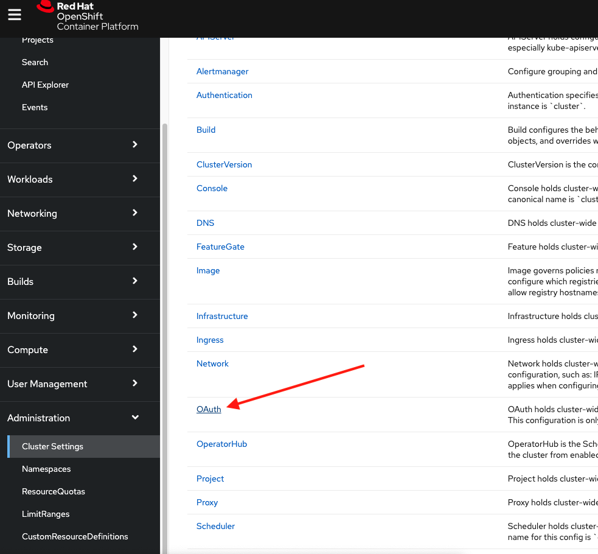

# Setup Federated Authentication using GitHub

## Prerequisites

1. Have an OpenShift (OCP) v4.x running cluster
2. Have a GitHub Account

## GitHub Setup

On your GitHub account go to to the upper right corner and go to Settings:


Then go to organizations:


And click on `New organization`:


Select a free plan and provide an Org name, then if you want add people to the newly created organization for access.

Then under your organizations find the newly created organization and click settings:


Then go on the left menu to Developer settings and click on `Register an application`:


Use any name for the application, I recommend using the name of your cluster, then add the homepage URL and oauth callback url. 
Because we are using OCP then the URLs may look like:
Homepage URL:
```
https://oauth-openshift.<YOUR-DOMAIN>.com
```
OAuth Callback URL:
```
https://oauth-openshift.<YOUR-DOMAIN>.com/oauth2callback/github/
```
Then click on `Register application`. After registering the application the new screen is going to provide the `Client ID` and the ability to generate a secret to be used on our OCP cluster settings: 


Generate a secret and copy or save the `Client ID` and `client secret` to be used on the OCP setup.

#

## OpenShift (OCP) Setup

Login onto the OCP cluster as an admin and on the left menu go to Administration:


Then click on `Cluster settings` -> `Global configuration` and find `OAuth`:


Click on `OAuth`:



and under `Identity providers` add a GitHub provider: 


This would bring you to a GitHub form to provide the `Client ID` and `Client secret` saved from the GitHub setup:


Don't forget to scroll down and add the organization name where you GitHub app belongs to:


You successfully secured your cluster with federated authentication from GitHub.

## Optional

If you want you can create the OAuth provider using the CLI instead of the web console you can by specifying a `Oauth` resource instead. Check the file `Oauth.yaml` in this folder, make sure you replace in the file the `Client ID`, `Client secret` and GitHub organization, then apply the file using the `oc` CLI tool as follows:

```
oc apply -f Oauth.yaml 
```

Most likely if you follow all previous steps you are going to end up with developer access role to your cluster using your GitHub credentials. 

If you want to define groups of users with an specific role like cluster `Admin` you can by creating a resource called `Group` listing all the users like the file `Group.yaml` presents, then you can apply as follows:

```
oc apply -f Group.yaml 
```
You should expect a response along the lines: `group.user.openshift.io/rhc-admins created`.

The using the resource `ClusterRoleBinding` as described on the file `ClusterRoleBinding.yaml` you can bind the `admin` role to the group listing of accounts you want.
