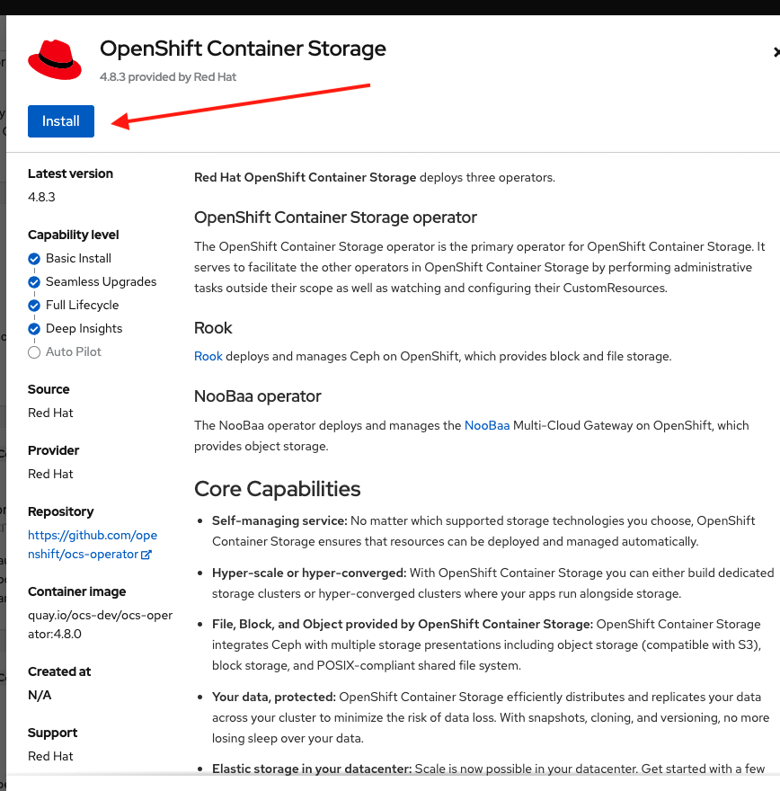

# Provision OpenShift Data Foundation

In this lab we are going to provision OpenShift Data Foundation using the operator in order to create the storage class instance and for the PV and PVC used by 3Scale.
## Prerequisites

1. Have an OpenShift (OCP) v4.x running cluster
2. Have a GitHub Account
3. OCP cluster with at least 3x MachineSets scaled up and 3x worker nodes

## Install OpenShift Data Foundation using the Operator

On the OCP web console go to the left menu `Operators` then go to `OperatorHub`:


In the search field search for `storage` and look for the `OpenShift Container Storage` (OCS) tile:


On the new screen click on install:



In the next screen, install the OpenShift Container Storage Operator into the recommended namespace `openshift-storage` and click on `Install` again:


After the operator gets installed, monitor the `openshift-storage` ns for pods to be ready:

```
oc get pods -n openshift-storage -w
```

When all pods get ready (status == running), then you can use the operator to create a `StorageCluster` instance to be used by your applications, in our case, 3Scale. 

For this you can either use the OC CLI tool or you can use the form dialog after you click on the blue button in the operator details tab named `Create StorageCluster`:


Select the AWS-EBS gp2 StorageClass and for our application we only need 512Gb. Make sure you select at least 3 nodes and click on next until you get to the blue button named `Create` and click it.

If you want to do this same process using the `oc` cli tool you can start by labeling the nodes where OpenShift Container Storage should be hosted. If all worker nodes should be used, the following command can be used to label them:

```
for node in $(oc get node -l node-role.kubernetes.io/worker -o name); do oc label ${node} cluster.ocs.openshift.io/openshift-storage=""; done
```

Then review the included file `StorageCluster.yaml` which defines the gp2 StorageClass requesting 512Gi, then apply the StorageCluster:

***NOTE***
***
You should only do one of the two methods, either create the instance using the web console or the oc cli tool but not both.
***
```
oc apply -f StorageCluster.yaml -n openshift-storage
```

3scale requires a RWX storage class. The storage class used by the 3scale control plane will be `ocs-storagecluster-cephfs`. Ensure that the storage class is available with the following command.

```
oc get storageclasses
```

You can monitor the pods in the same `openshift-storage` ns and finally when ready you should see the `BackingStore`, `BucketClass` and `CephBlockPool` instances ready under the operator's page All Instances tab:


You successfully created a new OCS instance to be used by 3Scale.