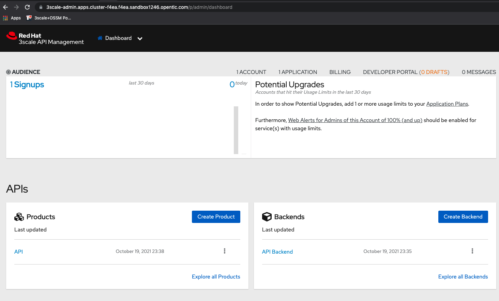

# Test your 3Scale Installation

## Prerequisites

1. Have an OpenShift (OCP) v4.x running cluster
2. Have a 3Scale API Manager working instance

## Test

In the API Manager web console, under the APIs Product section, click on the out-of-the-box included product named `API`:



Inspect the backend for this service under `Integration` -> `Configuration` -> `Backends`, you should see: `https://echo-api.3scale.net:443`. Try out in a browser or using `curl`.

Now Go to the left menu under `Integration` -> `Configuration` and click on the blue button named `Promote v. 1 to Staging APIcast`:


This would "promote" the configuration to expose the backend `API` echo service through the "Staging" APIcast instance secured using an API-key `user-key`. You can test this service in a terminal window by doing:
```
curl "https://api-3scale-apicast-staging.apps.cluster-f4ea.f4ea.sandbox1246.opentlc.com:443/?user_key=c13956baccf3c4f28ef2fa1139c46333"
```
You should see the same response you got when you tried the backend service.
Congratulations your 3Scale API Management installation is working as expected.