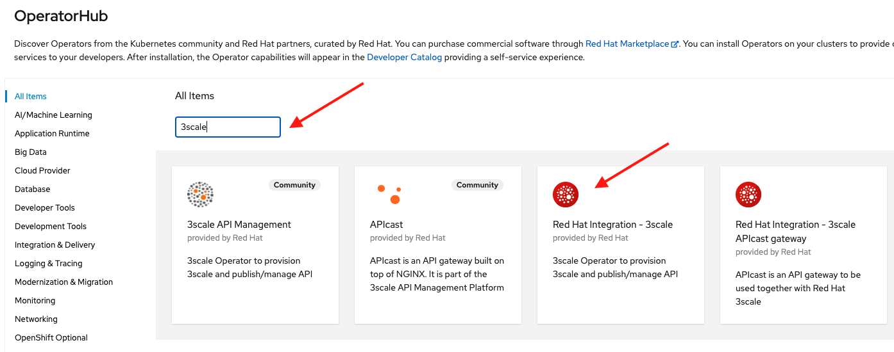
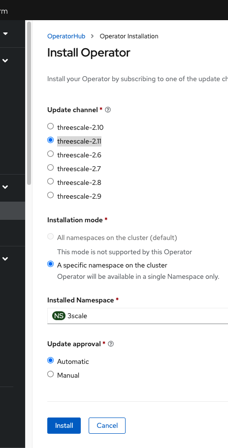
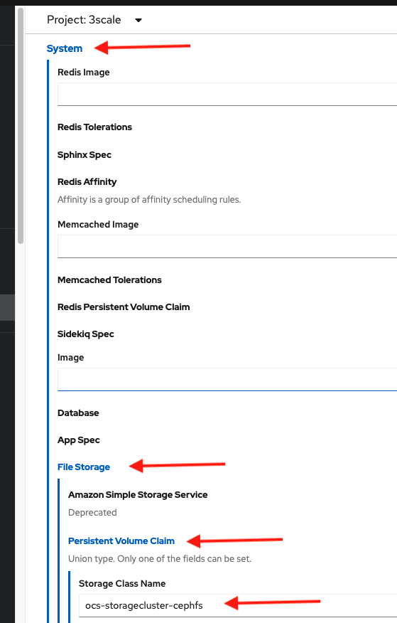
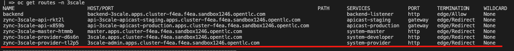
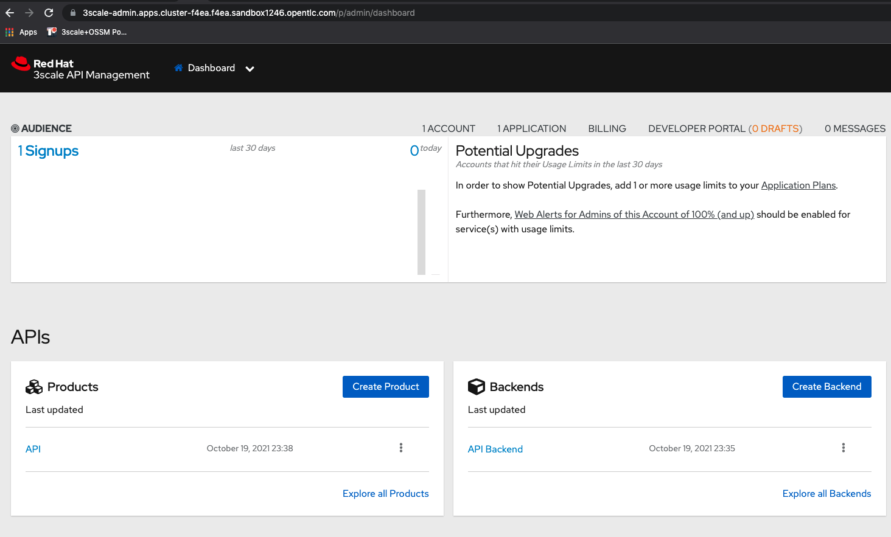

# Provision 3Scale

In this lab we are going to provision a 3Scale control plane instance named API Manager using the operator.

## Prerequisites

1. Have an OpenShift (OCP) v4.x running cluster
2. OCP cluster with at least 3x MachineSets scaled up and 3x worker nodes

## Install the 3scale Operator

Create a new namespace (ns) named `3scale` either using the web console under Home -> Projects -> Create Project or on the cli by doing:

```
oc new-project 3scale
```

On the OCP web console go to the left menu `Operators` then go to `OperatorHub`:


In the search field search for `3scale` and look for the `Red Hat Integration - 3Scale` operator tile and click on it:



On the next screen click install, in the next form make sure you select `threescale-2.11` as the update channel and install under a specific ns named `3scale`:



Make sure the 3scale operator pods are ready before going to the next step.

## Provision a 3scale API Manager (Control plane) instance

You can provision an API manager instance either using the web console UI or the OC CLI tool. If you want a faster approach jump to the CLI tool.

### Using the UI

Go to the 3Scale operator page by going to the console left menu Operators -> Installed Operators then select the 3scale ns and click on the `Red Hat Integration - 3Scale` operator.

Then go to the tab named `APIManager` and click on `Create APIManager`,  make sure you add in the form the name: `apimanager-instance`, then update the wildcard domain using your cluster domain:

Example wildcard domain: `apps.cluster-8glcz.8glcz.sandbox730.opentlc.com`

Then expand in the form the section named `System` -> `File Storage` -> `Persistent Volume Claim` -> `Storage Class Name` and add the name of the Storage Class we created on the previous lab named `ocs-storagecluster-cephfs`:



Finally scroll down and click on the blue button `Create`. Validate you have a new instance under the `APIManager` operator page named `apimanager-instance`.

### Using the OC CLI Tool

Set the cluster wildcard domain and the Storage Class name in `APIManager.yaml` then apply it using the cli:

```
oc apply -f APIManager.yaml -n 3scale
```

The 3Scale APIManager control plane instance should have at least 15 pods running and in ready state before you can use the instance.

## Verify your instance

On the 3scale ns get the route for the system-provider service:

```
oc get routes -n 3scale
```



Copy it and load it in a browser. You can find the `admin` credentials on the `system-seed` secret, copy the `admin_user` and `admin_password` values and use them to log into the management console. Skip or follow the start wizard and if you can see the Dashboard page you have correctly provisioned an API Manager instance:



