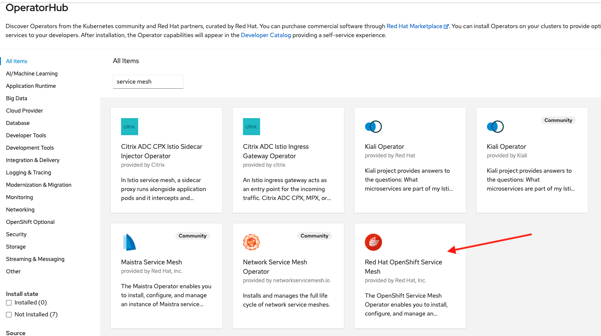

# Provision OpenShift Service Mesh (based on Istio)

In this lab we are going to provision a Service Mesh control plane (SMCP) instance using the operator.

## Prerequisites

1. Have an OpenShift (OCP) v4.x running cluster
2. OCP cluster with at least 3x MachineSets scaled up and 3x worker nodes
3. Install the following SM required components before installing the SM operator (could be installed also using operators):
    - Install Elasticsearch operator in all namespaces
    - Install Jaeger operator in all namespaces
    - Install Kiali operator in all namespaces

## Install OpenShift Service Mesh (SM) using the Operator

On the OCP web console go to the left menu `Operators` then go to `OperatorHub`:


In the search field search for `service mesh` and look for the `OpenShift Service Mesh` (OSSM) tile:



Create a new namespace (ns) named `istio-system` either using the web console under Home -> Projects -> Create Project or on the cli by doing:

```
oc new-project istio-system
```

When ready, create a Service Mesh Control Plane (SMCP) instance either using the CLI or web console. There are two important definitions in order for OSSM to work properly with 3Scale:

1. Configure your control plane policy as `Mixer`:
```
spec:
  policy:
    type: Mixer
    mixer:
      enableChecks: true
```
2. Enable the 3Scale addon (adapter):
```
spec:
  addons:
    3scale:
      enabled: true
```

If using the OC CLI tool, review the file `ServiceMeshControlPlane.yaml` and apply it as follows:

```
oc apply -f ServiceMeshControlPlane.yaml -n istio-system
```

Watch your pods until they are ready:
```
oc get pods -w -n istio-system
```

and expect something like:
```
oc get pods -w -n istio-system
NAME                                    READY     STATUS    RESTARTS   AGE
3scale-istio-adapter-6f7d688486-ltw2t   1/1       Running   0          3m
grafana-76c57d9895-88jz4                2/2       Running   0          4h
istio-egressgateway-7bd88577bd-f2fkj    1/1       Running   0          4h
istio-ingressgateway-b5d4b99cc-ldk6d    1/1       Running   0          4h
istio-policy-6f6b4fd589-bv7l2           2/2       Running   0          4h
istio-telemetry-7b99847cd4-rzhbs        2/2       Running   0          3m
istiod-basic-6985d799ff-ln2vs           1/1       Running   0          4h
jaeger-7c7d69bdf9-j9j2l                 2/2       Running   0          4h
kiali-7765d6ddcf-tt2w5                  1/1       Running   0          1m
prometheus-7b7fd89bb4-648nv             3/3       Running   0          4h
```

Make sure you have all the routes you need created for your SMCP instance:
```
oc get routes -n istio-system
NAME                                         HOST/PORT                                                                                                PATH      SERVICES               PORT      TERMINATION          WILDCARD
bookinfo-bookinfo-gateway-525eca1d5089dbdc   bookinfo-bookinfo-gateway-525eca1d5089dbdc-istio-system.apps.cluster-f4ea.f4ea.sandbox1246.opentlc.com             istio-ingressgateway   http2                          None
grafana                                      grafana-istio-system.apps.cluster-f4ea.f4ea.sandbox1246.opentlc.com                                                grafana                <all>     reencrypt/Redirect   None
istio-ingressgateway                         istio-ingressgateway-istio-system.apps.cluster-f4ea.f4ea.sandbox1246.opentlc.com                                   istio-ingressgateway   8080                           None
jaeger                                       jaeger-istio-system.apps.cluster-f4ea.f4ea.sandbox1246.opentlc.com                                                 jaeger-query           <all>     reencrypt            None
kiali                                        kiali-istio-system.apps.cluster-f4ea.f4ea.sandbox1246.opentlc.com                                                  kiali                  <all>     reencrypt/Redirect   None
prometheus                                   prometheus-istio-system.apps.cluster-f4ea.f4ea.sandbox1246.opentlc.com                                             prometheus             <all>     reencrypt/Redirect   None
```
Finally check that the status of your SMCP instance is `ComponentsReady`:
```
oc get smcp basic -n istio-system
```
Expect:
```
NAME      READY     STATUS            PROFILES      VERSION   AGE
basic     12/12     ComponentsReady   ["default"]   2.0.8     8h
```

Congratulations, your SMCP is up and running.

***NOTE***
***
If a LimitRange is defined, it may prevent pods from starting if limits are too low. It may be necessary to adjust or delete.

You can adjust/delete this RangeLimit by going to `Administration` -> `LimitRanges` in the `istio-system` ns.
***