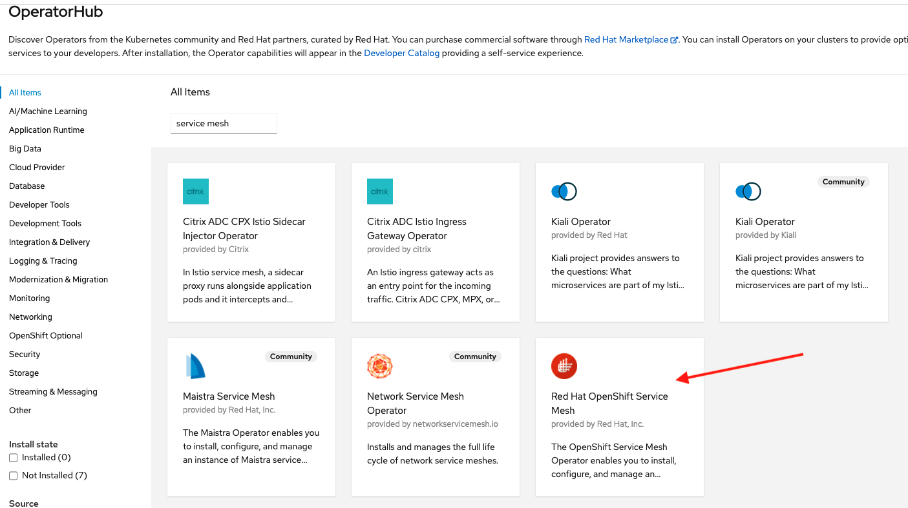

# Provision OpenShift Service Mesh (based on Istio)

In this lab we are going to provision a Service Mesh control plane (SMCP) instance using the operator.

## Prerequisites

1. Have an OpenShift (OCP) v4.x running cluster
2. OCP cluster with at least 3x MachineSets scaled up and 3x worker nodes
3. Install the following SM required components before installing the SM operator (could be installed also using operators):
    - Install Elasticsearch operator in all namespaces
    - Install Jaeger operator in all namespaces
    - Install Kiali operator in all namespaces

## Install OpenShift Service Mesh (SM) using the Operator

On the OCP web console go to the left menu `Operators` then go to `OperatorHub`:


In the search field search for `service mesh` and look for the `OpenShift Service Mesh` (OSSM) tile:



Create a new namespace (ns) named `istio-system` either using the web console under Home -> Projects -> Create Project or on the cli by doing:

```
oc new-project istio-system
```

When ready, create a Service Mesh Control Plane (SMCP) instance either using the CLI or web console. There are two important definitions in order for OSSM to work properly with 3Scale:

1. Configure your control plane policy as `Mixer`:
```
spec:
  policy:
    type: Mixer
    mixer:
      enableChecks: true
```
2. Enable the 3Scale addon (adapter):
```
spec:
  addons:
    3scale:
      enabled: true
```

If using the OC CLI tool, review the file `ServiceMeshControlPlane.yaml` and apply it as follows:

```
oc apply -f ServiceMeshControlPlane.yaml -n istio-system
```

If a LimitRange is defined, it may prevent pods from starting if limits are too low. It may be necessary to adjust or delete.

TODO: Research whether the LimitRange is coming from the OSSM operator and what is the best way to optimize the limits.