# Secure the Bookinfo App Using OSSM and 3scale

The goal for this lab is to use the `bookinfo` app and secure it using OSSM and 3Scale with the API Manager serving as Control plane and the Istio's Ingress gateway to access the service. 

## Prerequisites

1. Have an OpenShift (OCP) v4.x running cluster
2. Have SMCP working instance (OSSM v2.0 not 2.1 as Mixer is required)
3. Have the `bookinfo` example app deployed, including the VirtualService and Gateway.

## Generate Handler, Rule and Instance Resources

When we provisioned our SMCP instance, we enabled the 3Scale addon (adapter) which includes an utility to generate the `Handler`, `Instance` and `Rule` Service Mesh resources, in order to be used in conjunction with 3Scale's control plane the API Manager.

***NOTE***
***
On the previous 3scale release v2.10 and OSSM v2.0 the 3scale/OSSM integration was done using the 3scale adapter, which uses gRPC to communicate with the OSSM CP Mixer component for policy enforcement. In OSSM v2.1 the Mixer component was completely removed and now in favor of the `ServiceMeshExtension` using WebAssembly.
***

To generate these resources export the following to variables:
1. The ns where your SMCP instance resides:
```
export NS="istio-system"
```
2. The URL for your 3Scale API manager:
```
export URL="https://3scale-admin.apps.cluster-f4ea.f4ea.sandbox1246.opentlc.com/"
```
3. The name of you SMCP instance:
```
export NAME="basic"
```
4. Copy the 3Scale admin token to access your API Manager instance:
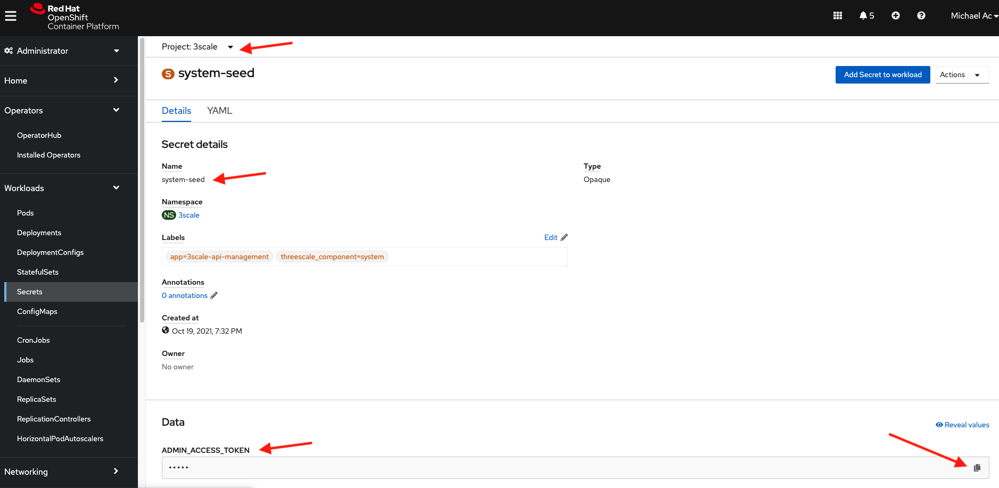
And export it:
```
export TOKEN="<3SCALE-ADMIN-ACCESS-TOKEN>"
```

***NOTE***
***
The 3scale/OSSM integration uses the 3scale adapter, which uses gRPC to communicate with the OSSM CP Mixer component for policy enforcement. The following instructions are only for 3scale v2.10 and OSSM v2.0 using the Mixer component.
***

5. Execute the `3scale-config-gen` script as follows:
```
oc exec -n ${NS} $(oc get po -n ${NS} -o jsonpath='{.items[?(@.metadata.labels.app=="3scale-istio-adapter")].metadata.name}') \
-it -- ./3scale-config-gen \
--url ${URL} --name ${NAME} --token ${TOKEN} -n ${NS}
```

Expect a print on std out defining the `Handler`, `Instance` and `Rule` Service Mesh resources:
```
apiVersion: config.istio.io/v1alpha2
kind: handler
metadata:
  creationTimestamp: null
  name: basic
  namespace: istio-system
spec:
  adapter: threescale
  connection:
    address: dns:///threescale-istio-adapter:3333
  params:
    access_token: <3SCALE-ADMIN-ACCESS-TOKEN>
    system_url: https://3scale-admin.apps.cluster-f4ea.f4ea.sandbox1246.opentlc.com/
---
apiVersion: config.istio.io/v1alpha2
kind: instance
metadata:
  creationTimestamp: null
  name: basic
  namespace: istio-system
spec:
  params:
    action:
      method: request.method | "get"
      path: request.url_path
      service: destination.labels["service-mesh.3scale.net/service-id"] | ""
    subject:
      properties:
        app_id: request.query_params["app_id"] | request.headers["app_id"] | ""
        app_key: request.query_params["app_key"] | request.headers["app_key"] | ""
        client_id: request.auth.claims["azp"] | ""
      user: request.query_params["user_key"] | request.headers["user_key"] | ""
  template: threescale-authorization
---
apiVersion: config.istio.io/v1alpha2
kind: rule
metadata:
  creationTimestamp: null
  name: basic
  namespace: istio-system
spec:
  actions:
  - handler: basic.handler.istio-system
    instances:
    - basic.instance.istio-system
  match: |-
    context.reporter.kind == "inbound" &&
    destination.labels["service-mesh.3scale.net/credentials"] == "basic" &&
    destination.labels["service-mesh.3scale.net/authentication-method"] == ""
---
```

***NOTE***
***
Do not include a port for the 3scale URL, this will cause a parsing error in the Istio policy pod
***

6. Apply the output to the `istio-system` namespace or update the contents of this directory in this repository and apply:
```
oc apply -f Handler.yaml -f Instance.yaml -f Rule.yaml -n istio-system
```

Finally expect an output as follows:
```
handler.config.istio.io/basic created
instance.config.istio.io/basic created
rule.config.istio.io/basic created
```

#

## Configure BookInfo 3scale Product

Log into 3scale using the route whose hostname begins with `3scale-admin` in the `3scale` namespace.

NOTE: You will find the admin username and password in a secret called `system-seed` in the `3scale` namespace.

1. Create a new Product and give it any name, we suggest you use `bookinfo`:
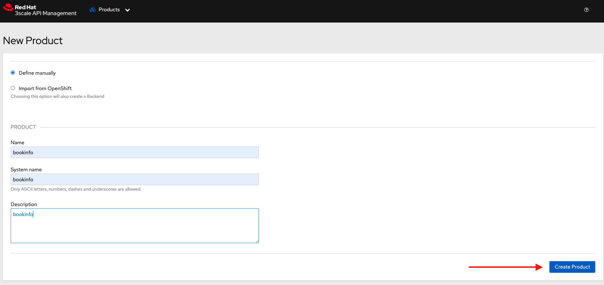

2. Go to `Integration` -> `Settings` and choose `Istio` as the deployment mode, leave API key as authentication method and click on `Update Product`:
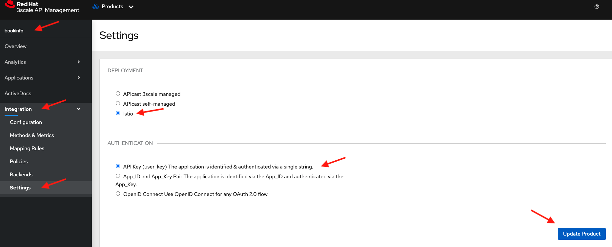

3. Go back to `Integration` -> `Configuration` and update the configuration:
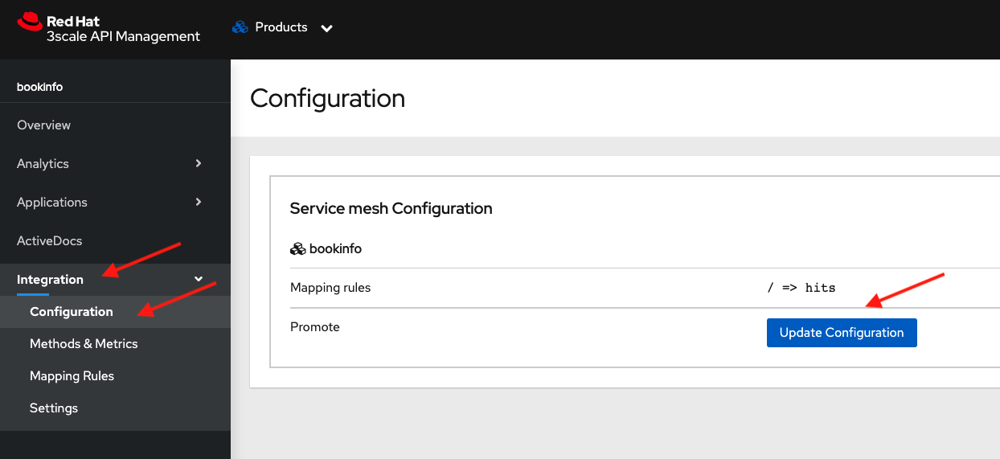

4. Go to `Application` -> `Application Plans` and create a new one:
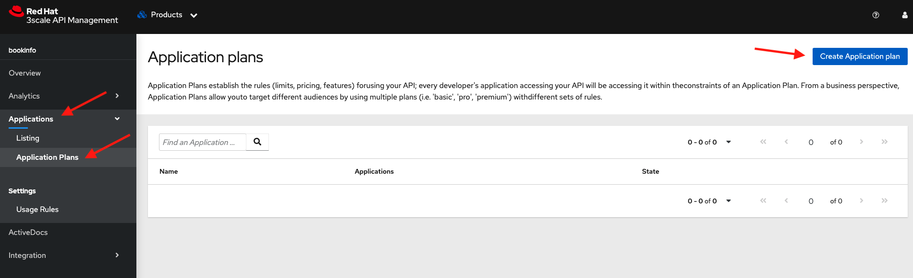

5. Name the plan `bookinfo-plan` and click on create application plan:
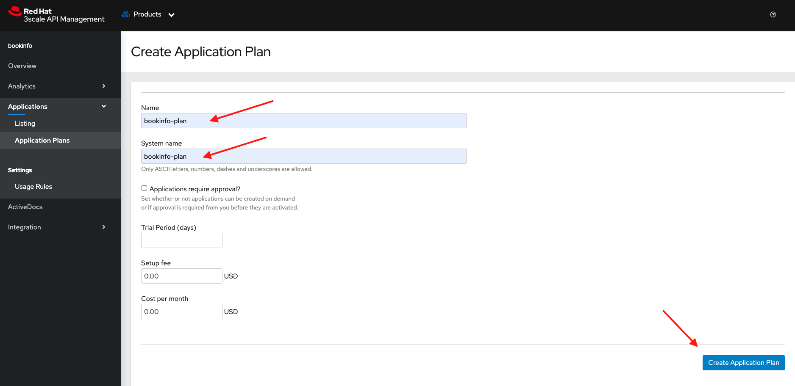

6. Verify the state plan is `hidden` and click on the 3 dots next to it to publish the plan:
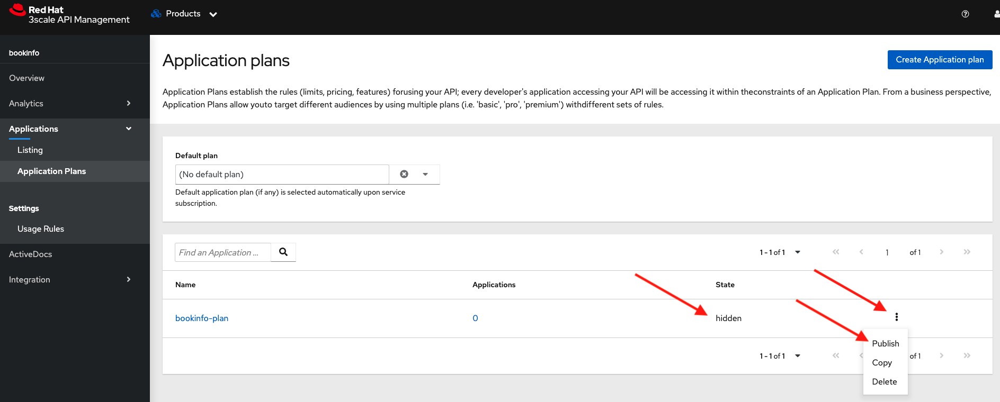

7. Go to the Product Overview and take note of the ID given to the API (This will be used in the next step):
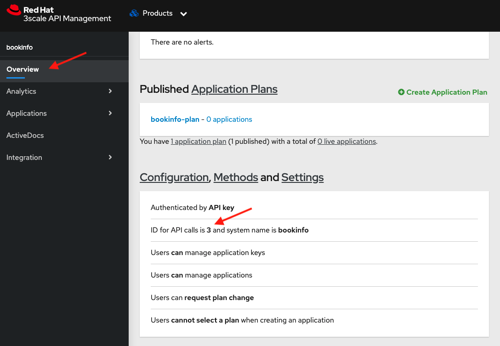

## Label Pods in BookInfo

Adjust the pod spec template for your target service. You will need two values:
- The 3scale API ID (from the previous step)
- The name of your handler

The pod labels will look something like this:
```
spec:
  template:
    metadata:
      labels:
        app: productpage
        service-mesh.3scale.net/credentials: basic
        service-mesh.3scale.net/service-id: '3'
```
The number 3 is the ID of our product in 3scale:
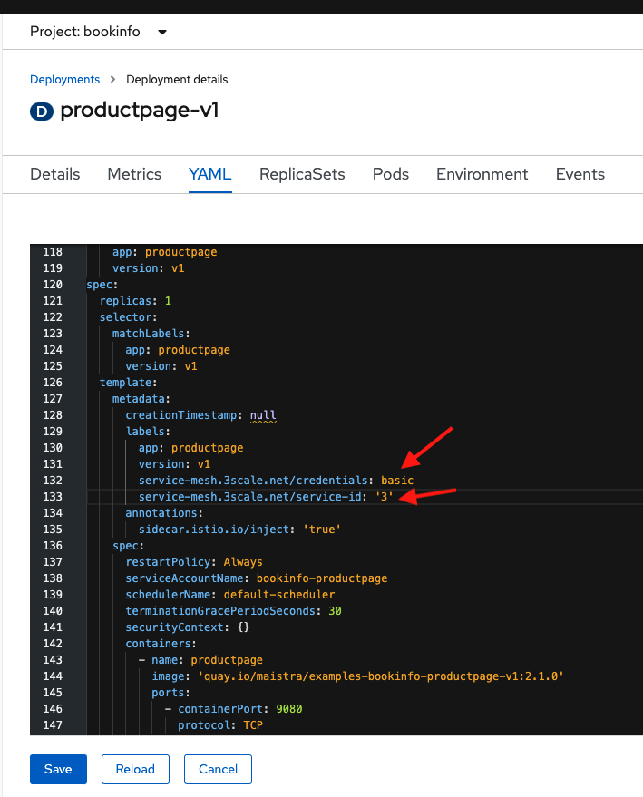

Save and watch how the deployment resource spins up a new pod with the labels.

## Authorize an Application to Consume the API

1. In 3scale, go to `Audience` and choose an account to authorize (you can use the default Developer account):
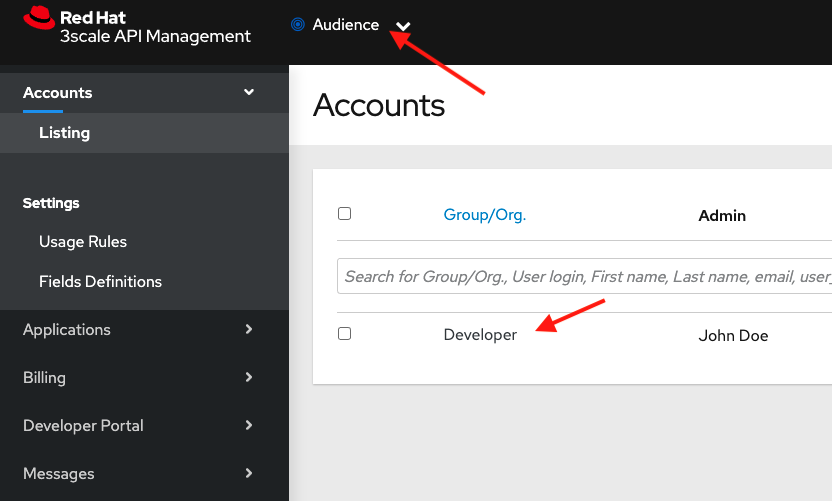

2. Follow the Link at the top of the page that says `N Applications` (N being the number of applications the account has) and click to create a new application:
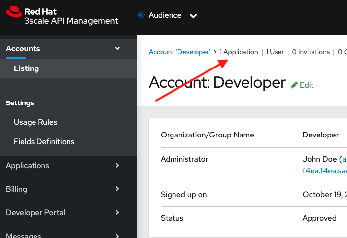

3. On the upper right corner click on `Create Application`:
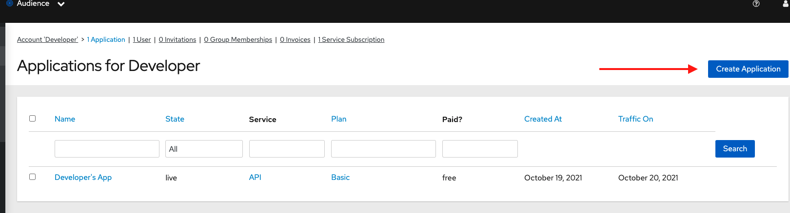

4. Fill out the form with the product and plan you created then click on `Create Application`:
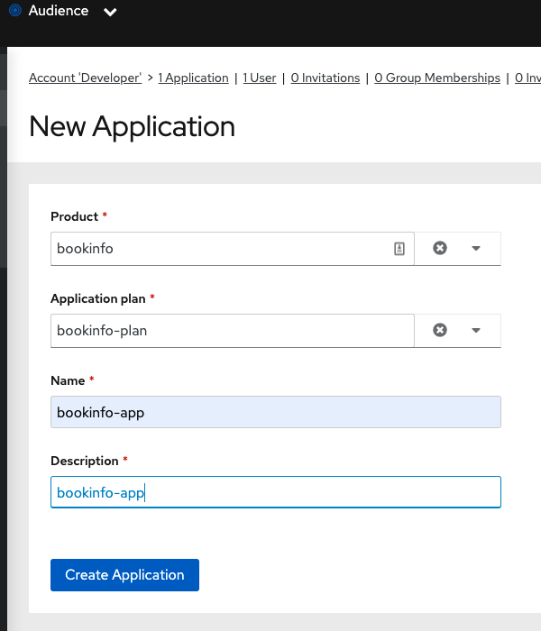

5. You should now have an API key that you can copy and use for authorization:
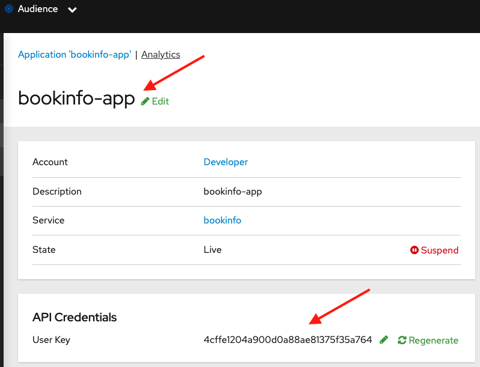
Copy this key and export it to a shell variable for later use:
```
export USERKEY=<MYAPPKEY>
```

#

## Verify the access enforcement

Lets try to access the service first without credentials:
 
1. Find your ingress gateway route using:
```
ISTIO_GW=$(oc get route istio-ingressgateway -n istio-system -o jsonpath="{.spec.host}{.spec.path}")
```
```
echo $ISTIO_GW
```

2. Try now the bookinfo service without user key:
```
curl -v $ISTIO_GW/productpage
```
You should see an HTTP `401 Unauthorized` response and a message along with the lines of: 
```
UNAUTHENTICATED:basic.handler.istio-system:no auth credentials provided or provided in invalid location
```

3. Now lets try access with credentials (from the previous step):

```
curl -v $ISTIO_GW/productpage?user_key=$USERKEY | grep '<title>Simple Bookstore App</title>'
```

You should see an HTTP `200 OK` response code with a message along the lines:
```
* TCP_NODELAY set
* Connected to istio-ingressgateway-istio-system.apps.cluster-f4ea.f4ea.sandbox1246.opentlc.com (18.218.151.134) port 80 (#0)
> GET /productpage?user_key=4cffe1204a900d0a88ae81375f35a764 HTTP/1.1
> Host: istio-ingressgateway-istio-system.apps.cluster-f4ea.f4ea.sandbox1246.opentlc.com
> User-Agent: curl/7.54.0
> Accept: */*
> 
< HTTP/1.1 200 OK
< content-type: text/html; charset=utf-8
< content-length: 5179
< server: istio-envoy
< date: Wed, 20 Oct 2021 23:41:45 GMT
< x-envoy-upstream-service-time: 57
< set-cookie: cd10b69e39387eb7ec9ac241201ab1ab=7e2f83ff8d992b1f630ff28f6509fef0; path=/; HttpOnly
< cache-control: private
< 
{ [1153 bytes data]
100  5179  100  5179    0     0  32742      0 --:--:-- --:--:-- --:--:-- 32778
* Connection #0 to host istio-ingressgateway-istio-system.apps.cluster-f4ea.f4ea.sandbox1246.opentlc.com left intact
    <title>Simple Bookstore App</title>
```

Congratulations, you successfully secured the `bookinfo` `productpage` app using 3Scale API Manager and OpenShift Service Mesh Ingress gateway.