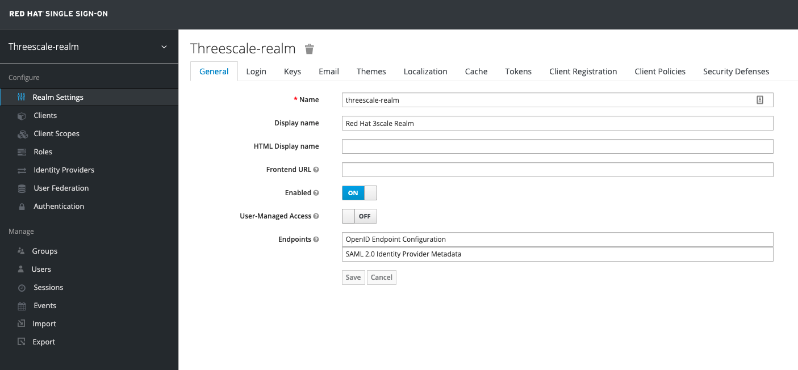
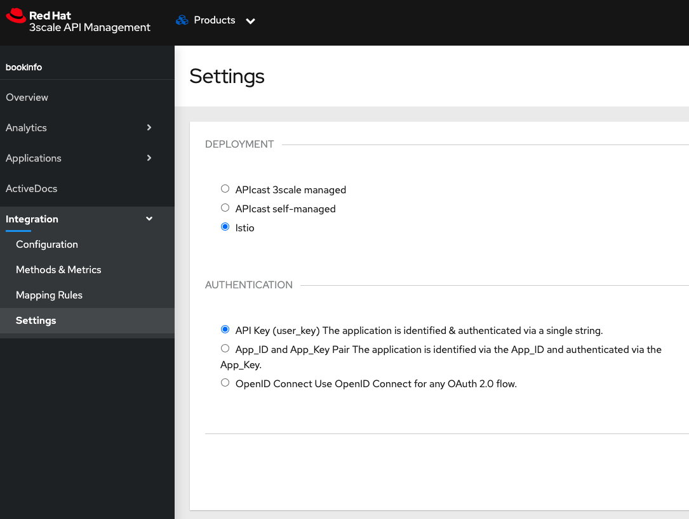
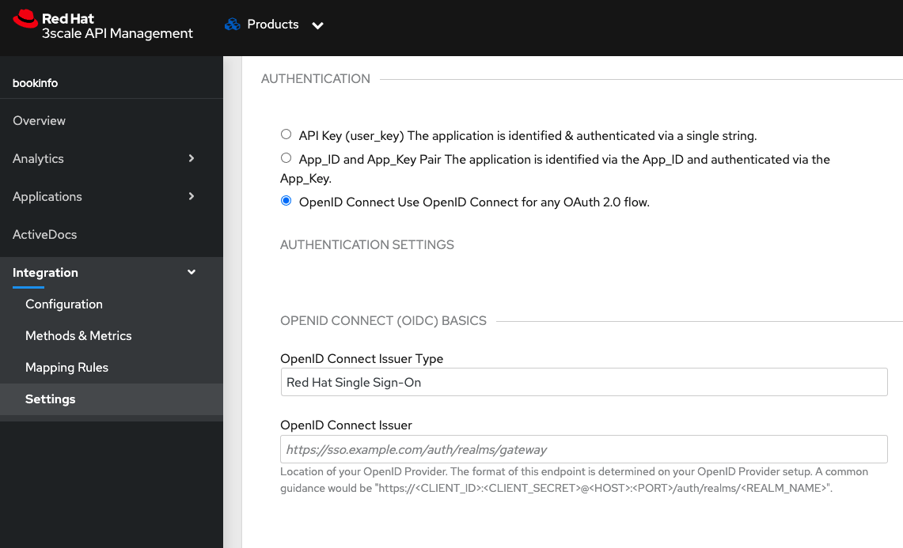
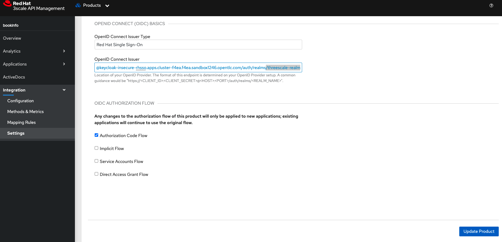
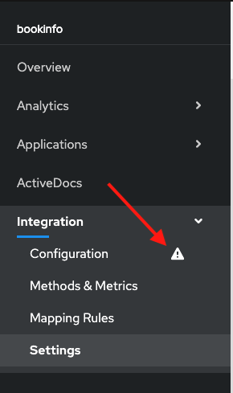
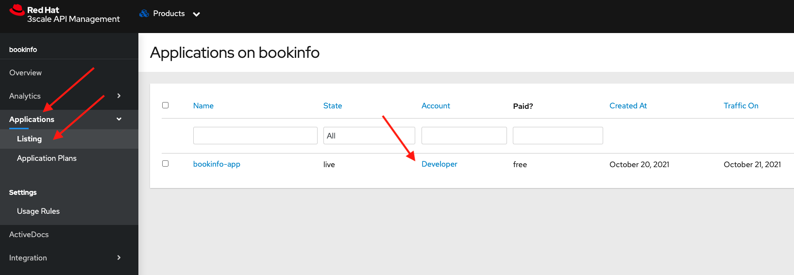
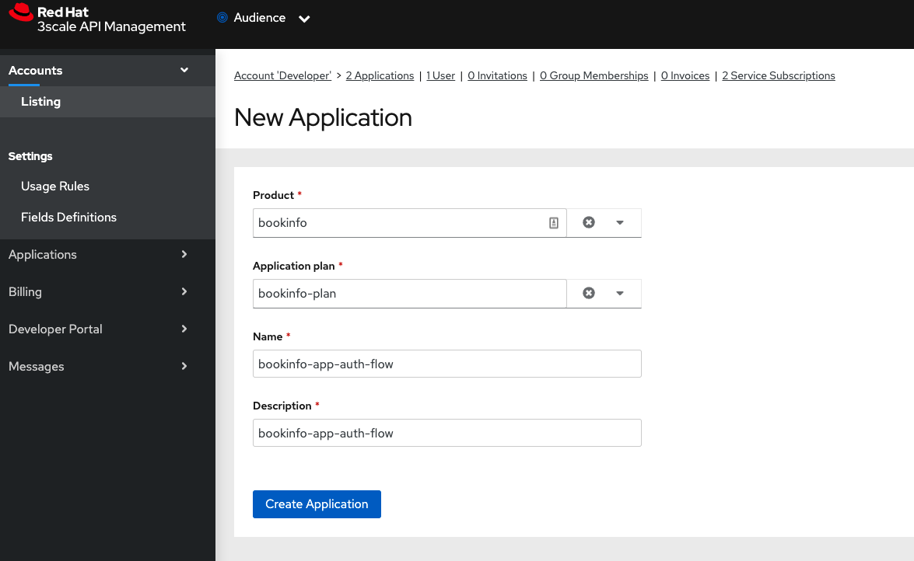
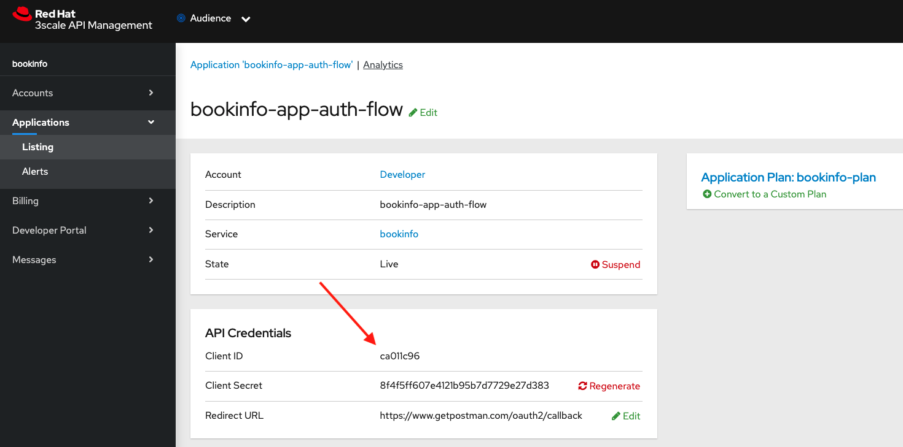
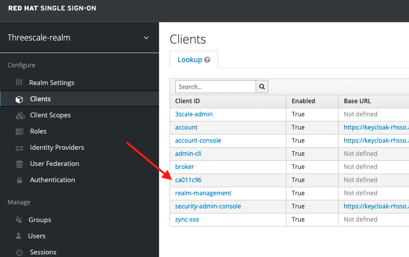

# Use Case: OIDC Authorization Code Flow using 3scale and OSSM

## Prerequisites

1. Have an OCP v4.x running cluster
2. OSSM v2.0 with a SMCP instance
3. Have installed the bookinfo example app on the `bookinfo` ns, part of SMMR and exposed gateway and virtual service, including adding the Istio labels to the service, Instance, Rule and Handler
4. Have installed the RHSSO operator with a `keycloak` instance named `sso` (We suggest installing it on the `rhsso` ns)
5. Have the bookinfo app setup as a 3scale product and protected using an API key (Previous lab)
6. Have Postman installed

## Test bookinfo access
Retrieve the URL for the ingress gateway:
```
ISTIO_GW=$(oc get route istio-ingressgateway -n istio-system -o jsonpath="{.spec.host}{.spec.path}")
```
```
echo $ISTIO_GW
```
You can now verify that the bookinfo service is responding:
```
curl -v $ISTIO_GW/productpage
```
You should see an HTTP 401 Unauthorized response.

Now lets try with the user-key token from 3scale product app:
```
curl -v $ISTIO_GW/productpage?user_key=$USERKEY | grep '<title>Simple Bookstore App</title>'
```
You should be able to get an HTTP 200 response code along with the `Simple Bookstore App` title.

#
## Setup the Realm clients

This section is a summarized version of the `3scale and Red Hat Single Sign-On Integration` section you can find on [04_3Scale_oidc-flows](../04_3Scale_oidc-flows/README.md#3scale-and-Red-Hat-Single-Sign-On-Integration). 

If you already have a `threescale-realm` and a `zync-sso` client configured on your keycloak instance (rhsso), then you can skip to the section [Update 3Scale Product Authentication Mechanism](#Update-3Scale-Product-Authentication-Mechanism).

### Setup the realm
In the same ns you installed the SSO operator (rhsso) and your keycloak instance (sso), find the `credential-sso` secret with the credentials needed to login into the keycloak admin console using the route in the same ns, e.g:
```
https://keycloak-rhsso.<WILDCARD_DOMAIN>.com/
```

These credentials should let you login as an `admin` into the `master` realm. 

On the left bar menu click on the `master` realm name and then on `add realm` and upload the file in this folder named: `rhsso-realm.json`.
 
This would create the `threescale-realm` realm and the user `user1` to be used on our lab. 

Log out and try to log into the `threescale-realm` using the username `user1` and the password `openshift`.

Now save the credentials by exporting them to variables on your terminal:
```
export RHSSO_REALM_USERID=user1
export RHSSO_REALM_PASSWD=openshift
```

After login in you should be able to see the keycloak admin console UI on the realm called `threescale-realm`. We are going to use this realm to create a client for our bookinfo app:


In the left bar menu under clients create a new client named `zync-sso` and hit `save`. Then make sure the `Standard Flow Enabled` is `off` and the `Service Accounts Enabled` flow is `on`, then finally check the `Access Type` is confidential then save.

This configures the `zync` client on the realm to be used by 3scale's OIDC Zync component using the Service Account flow to automatically create realm clients when 3scale product applications are created. Take note of the zync client name (`zync-sso` if not changed) and secret to be used as follows.

#
## Update 3Scale Product Authentication Mechanism

In 3scale admin's console go to the bookinfo product, `Integration` -> `Settings` -> `Deployment`and change it to: `Istio`:


Then go below to the Authentication section and change it from `user_key` to `OpenID Connect`. This would present the field to specify the OIDC issuer URL, e.g:
```
https://<CLIENT_ID>:<CLIENT_SECRET>@<HOST>:<PORT>/auth/realms/<REALM_NAME>
```


Where:
- CLIENT_ID: would be `zync-sso`
- CLIENT_SECRET: would be the secret saved from the credentials tab on the client's page
- HOST: / PORT: would be your keycloak host URL and port
- REALM_NAME: realm name would be `threescale-realm`
e.g:
```
http://zync-sso:<REALM-CLIENT-SECRET>@keycloak-insecure-rhsso.apps.cluster-f4ea.f4ea.sandbox1246.opentlc.com/auth/realms/threescale-realm
```

Finally make sure the checkbox that reads `Authorization Code Flow` is checked and hit the blue button that states "Update Product":


This would trigger for you product integration configuration to be updated:


Click on `Configuration` and click the blue button `Update Configuration`.

Now that your configuration is updated to use the `zync-sso` client, go to the bookinfo's product `Applications` -> `Listing` and then click on the `Developer` account or the account you used for your previous app:


In the account page click on the `N Applications` link at the top. Then click on the right `Create Application` and create a new application named `bookinfo-app-auth-flow`, selecting the `bookinfo-plan` and `bookinfo` product, then click on `Create Application` at the bottom:


The application page should state the client ID and secret under the API Credentials section. In the redirect URL field add:
```
https://www.getpostman.com/oauth2/callback
```


If everything worked as expected, you can double check this same client ID under the list of clients in your realms client list on the keycloak's console:


Save the client ID and secret under the API Credentials by exporting them to terminal variables, e.g:
```
export SSO_CLIENT_ID=4cedb1d3
export SSO_CLIENT_SECRET=184d6e7dc3415c73081b087e1f11e930
export SSO_URL=keycloak-rhsso.apps.cluster-c957.c957.sandbox749.opentlc.com
```
#
## Setup Service Mesh resources for bookinfo

In the previous lab we secured the `bookinfo` app using 3Scale's user-key, in this lab we are going to modify the existing `Rule` resource instance created in order to use OAuth2.
```
oc describe rule basic -n istio-system
```
The existing rule should match:
```
context.reporter.kind == "inbound" &&
    destination.labels["service-mesh.3scale.net/credentials"] == "basic" &&
    destination.labels["service-mesh.3scale.net/authentication-method"] == ""
```
Modify the rule to only match (See `Rule.yaml` in this directory):
```
context.reporter.kind == "inbound" &&
    destination.labels["service-mesh.3scale.net/credentials"] == "basic"
```
You can also apply the provided yaml:
```
oc apply -f Rule.yaml -n istio-system
```

Now create the `RequestAuthentication` resource which "tells" the Service Mesh control plane the JWT rules (issuer and URI) for the matched app label.

Review the `Request-auth.yaml` file and replace the `issuer` and `jwksUri` with the corresponding URLs from your SSO realm instance, e.g:
```
spec:
  jwtRules:
    - issuer: >-
        http://keycloak-insecure-rhsso.apps.cluster-c957.c957.sandbox749.opentlc.com/auth/realms/threescale-realm
      jwksUri: >-
        http://keycloak-insecure-rhsso.apps.cluster-c957.c957.sandbox749.opentlc.com/auth/realms/threescale-realm/protocol/openid-connect/certs
```
then create the resource:
```
oc apply -f Request-auth.yaml -n bookinfo
```
Expect a response:
```
requestauthentication.security.istio.io/jwt-example created
```

#
## Test the API with Authorization Code flow.

Check you have Postman installed:

```
$ which Postman
```
Open the Postman application. If this is the first time you used Postman, expect to be greeted with a sign-up page. Feel free to skip this stage and go directly to the application:


Expect to see the landing page of the Postman application:


Click *Create a request*. 

Enter the URL to the production APIcast of the _Products API OIDC_ application in the *Enter request URL* text box. 

The URL can be obtained from the following command:

```
echo $ISTIO_GW/productpage
```


Click *Send*

Expect a `401 Unauthorized` return code.


### Configure Postman to obtain an access token from the RH-SSO server.

Click the *Authorization* tab.

From the *Type* field, select _OAuth 2.0_.

Enter the following values into the *Configure New Token* dialog box:
* *Token Name*: `productpage Access Token`
* *Grant Type*: `Authorization Code`
* *Callback URL*: `https://www.getpostman.com/oauth2/callback`
* *Auth URL*: Use the following command to get the URL:
```
echo -en "\nhttps://$SSO_URL/auth/realms/$AMP_SSO_REALM/protocol/openid-connect/auth\n\n"
```
* *Access Token URL*: Use the following command to get the URL:
```
echo -en "\nhttps://$SSO_URL/auth/realms/$AMP_SSO_REALM/protocol/openid-connect/token\n\n"
```
* *ClientID*: The value of `$SSO_CLIENT_ID`
* *Client Secret*: The value of `$SSO_CLIENT_SECRET`
* *Scope* : openid
* *Client Authentication* : `Send as Basic Auth header`


Click *Get New Access Token*.

A new dialog box appears that shows the login screen for your realm on the RH-SSO server


Enter the username and password of a realm user.  For now, you can just use the values of `$RHSSO_REALM_USERID` and `$RHSSO_REALM_PASSWD`. Click *Log in*.

A new pop-up appears that shows the details of the Access token that was obtained from the RH-SSO server.

Click *Use Token*


Back on the request page, click *Send*. 

This time expect a successful response.


Congratulations! You have successfully secured your the `bookinfo` `productpage` using OpenID Connect Authorization code flow.