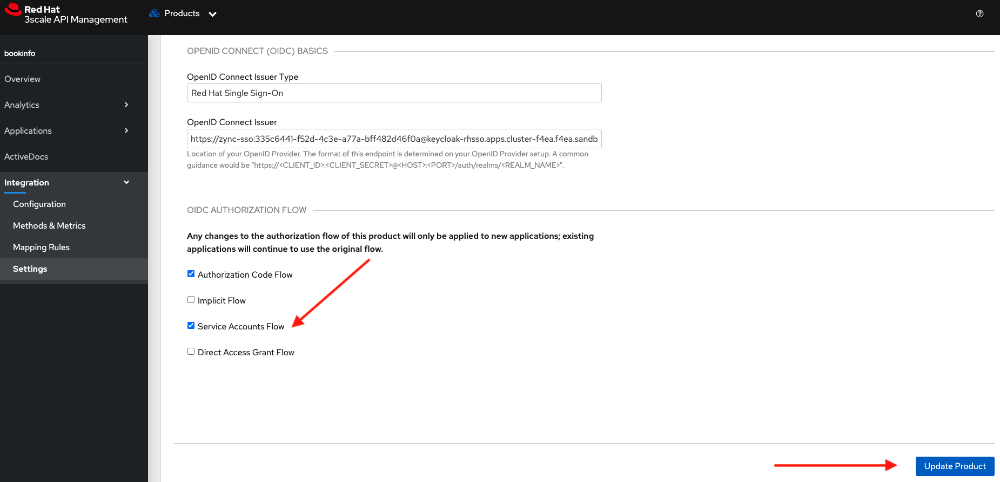
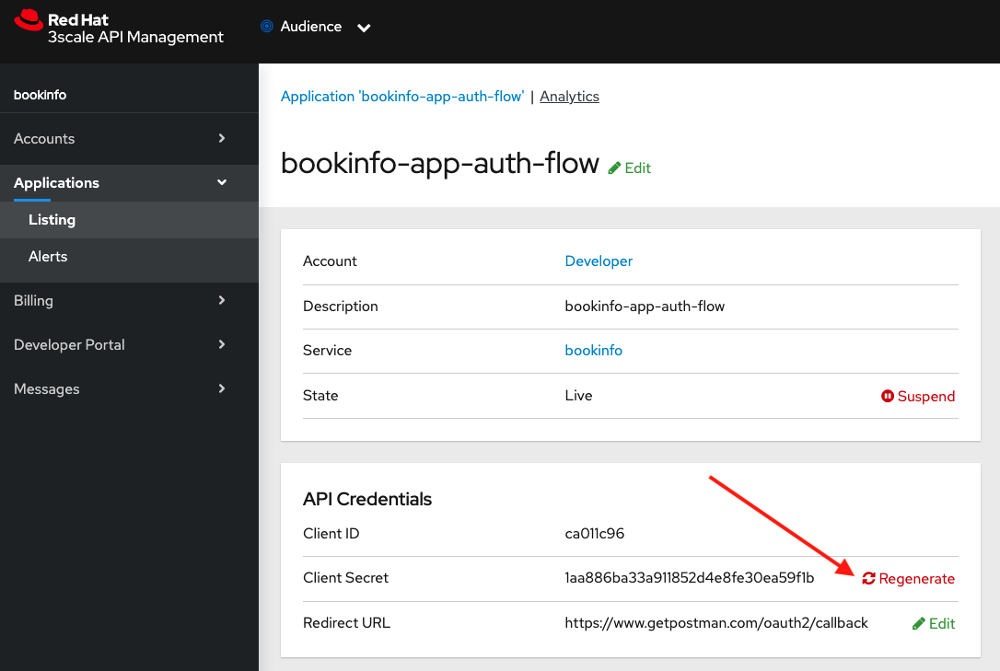

# Use Case: OIDC Client Credentials Flow using 3scale adapter and Istio

## Prerequisites

1. Have an OCP v4.x running cluster
2. OSSM v2.0 with a SMCP instance
3. Have installed the bookinfo example app on the `bookinfo` ns, part of SMMR and exposed gateway and virtual service, including adding the Istio labels to the service, Instance, Rule and Handler
4. Have installed the RHSSO operator with a `keycloak` instance named `sso` (We suggest installing it on the `rhsso` ns)
5. Have the bookinfo app setup as a 3scale product and protected using an API key (Previous lab)
6. Have Postman installed
7. Have done the previous [lab06](../06_Service_mesh_auth_code_flow/README.md)

## Test bookinfo access
Retrieve the URL for the ingress gateway:
```
ISTIO_GW=$(oc get route istio-ingressgateway -n istio-system -o jsonpath="{.spec.host}{.spec.path}")
```
```
echo $ISTIO_GW
```
You can now verify that the bookinfo service is responding:
```
curl -v $ISTIO_GW/productpage
```
You should see an HTTP 401 Unauthorized response.

Now lets try getting a token like on the previous lab using postman and then export it to a shell variable `TKN`:
```
export TKN=eyJhbGciOiJSUz...
```

Then use it on the following `curl` command:
```
curl -v -H "Accept: application/json" -H "Authorization: Bearer $TKN" $ISTIO_GW/productpage
```

You should be able to get an HTTP 200 response code along with the `Simple Bookstore App` title.

## Validate Service Mesh resources for bookinfo

You need to have from the previous lab:

1. Rule:
```
oc describe rule basic -n istio-system
```
2. Handler:
```
oc describe handler basic -n istio-system
```
3. Instance:
```
oc describe instance basic -n istio-system
```
4. RequestAuthentication:
```
oc describe requestauthentication jwt-example -n bookinfo
```
5. Have the `bookinfo` 3Scale product deployment set to `Istio` and the authentication to `OpenID Connect` with the issuer setup as described in the previous lab.

***NOTE***
***
If any of the described resources are not configured please recreate them as described on the previous lab
***

#
## Update Product OIDC Authorization Flow

Check the checkbox that reads `Service Accounts Flow` and hit the blue button that states "Update Product":


Go to the previously created Application and click on `Regenerate`:
 

Save the client ID and secret under the API Credentials by exporting them to terminal variables, e.g:
```
export SSO_CLIENT_ID=ca011c96
export SSO_CLIENT_SECRET=184d6e7dc3415c73081b087e1f11e930
export SSO_URL=keycloak-rhsso.apps.cluster-f4ea.f4ea.sandbox1246.opentlc.com
```
Now you can test getting a token from your keycloak instance, using the user credentials, client ID and secret as follows:
```
TKN=$(curl -k -X POST \
 -H "Content-Type: application/x-www-form-urlencoded" \
 -d "username=$RHSSO_REALM_USERID" \
 -d "password=$RHSSO_REALM_PASSWD" \
 -d "grant_type=client_credentials&client_id=$SSO_CLIENT_ID&client_secret=$SSO_CLIENT_SECRET" \
 https://$SSO_URL/auth/realms/threescale-realm/protocol/openid-connect/token \
| sed 's/.*access_token":"//g' | sed 's/".*//g')
```
Validate you got a proper token:
```
echo $TKN
```
Verify the contents by going to a jwt validator online like https://jwt.io and paste the content in the debugger. You should be able to validate in the payload the realm name and the client Id.

## Testing the OIDC flow 

Now try again to access the bookinfo productpage:
```
curl -v $ISTIO_GW/productpage
```
You should get a `401 Unauthorized` response. 

Now try again getting a token as explain before and sending it in the header:
```
curl -v -H "Accept: application/json" -H "Authorization: Bearer $TKN" $ISTIO_GW/productpage
```
You should receive a 200 response code along with the header `Authorization` and value `Bearer $TKN` including the productpage payload.

Congratulations! You successfully secured the `bookinfo` `productpage` service using the OAuth2 `Client Credentials` flow.

***NOTE***
***
Keep in mind the JWT token is setup to expire after 5 minutes so you may receive a 401 response code stating the JWT is `expired` meaning you need to get a new token.
***