# Service Mesh Observability

## Prerequisites

1. Have an OCP v4.x running cluster
2. OSSM v2.0 with a SMCP instance
3. Have installed the bookinfo example app on the `bookinfo` ns, part of SMMR and exposed gateway and virtual service

## Service Mesh Observability
Get your Kiali URL:

```
KIALI_URL=$(oc get route kiali \ -n istio-system -o jsonpath='{.spec.host}')
```

Open the URL on a browser and then click on the `bookinfo` app:

```
firefox ${KIALI_URL} &
```
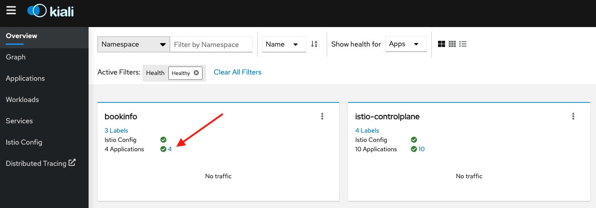

Make sure all services are healthy:
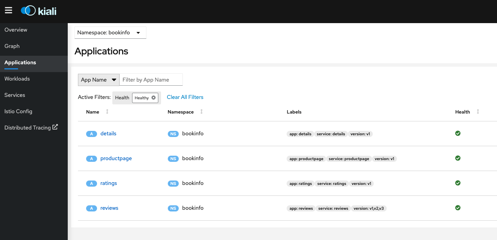

Call the `productinfo` page as done on the other labs:
```
ISTIO_GW=$(oc get route istio-ingressgateway -n istio-system -o jsonpath="{.spec.host}{.spec.path}")
```
```
curl $ISTIO_GW/productpage | grep '<title>Simple Bookstore App</title>'
```

Setup Kiali for traffic visualization by going to the left menu `Graph` then click on the drop down `Display` and select the `Request Percentage` and `Traffic Animation` options:
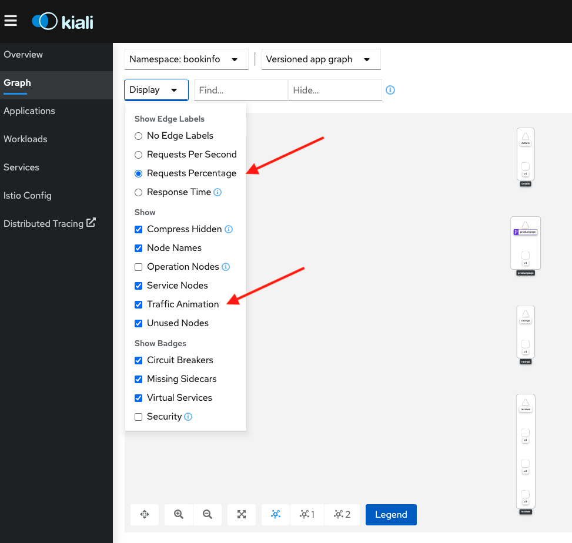

Now lets do a loop to generate requests to be able to watch the animation:
```
while true; \
do curl $ISTIO_GW/productpage | grep "< HTTP/1.1"; \
sleep 1;done
```

Switch to the graph and watch the animation, observe how the requests are mostly balanced between the three versions of the reviews service:
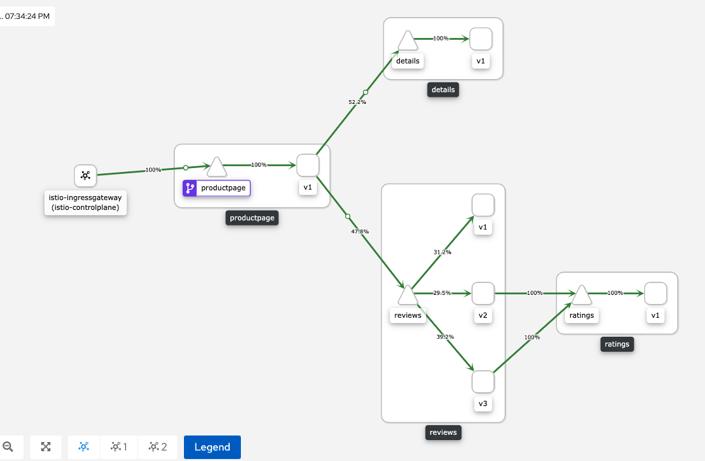

Select the reviews service by clicking on the node and observe on the right the incoming traffic:
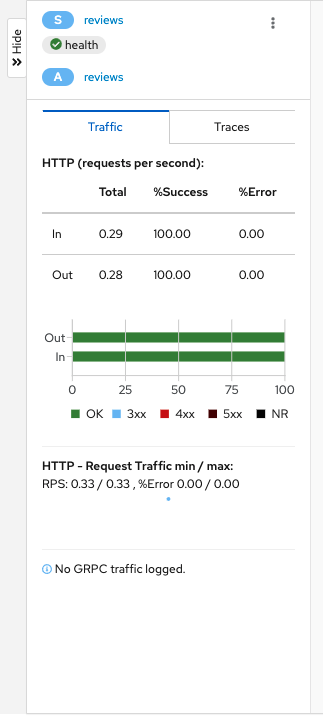

Now we are going to redirect all traffic to the v1 services by creating the `VirtualService` and `DestinationRules`, let start with the former which looks like:
```
apiVersion: networking.istio.io/v1alpha3
kind: DestinationRule
metadata:
  name: reviews
spec:
  host: reviews
  subsets:
  - name: v1
    labels:
      version: v1
  - name: v2
    labels:
      version: v2
  - name: v3
    labels:
      version: v3
```
Now apply them all:
```
oc apply -f https://raw.githubusercontent.com/maistra/istio/maistra-2.1/samples/bookinfo/networking/destination-rule-all.yaml -n bookinfo
```

Now lets review the corresponding `VirtualService`s:
```
apiVersion: networking.istio.io/v1alpha3
kind: VirtualService
metadata:
  name: reviews
spec:
  hosts:
    - reviews
  http:
    - route:
        - destination:
            host: reviews
            subset: v1
```
Now Apply:
```
oc apply -f https://raw.githubusercontent.com/maistra/istio/maistra-2.1/samples/bookinfo/networking/virtual-service-all-v1.yaml -n bookinfo
```

The combination of the above Virtual Services and destination Rules will enforce that `bookinfo` anonymous users all use v1 of all services.

Run the loop again and switch to the traffic animation:
```
while true; \
do curl $ISTIO_GW/productpage; \
sleep 3;done
```
You should see now something like this:
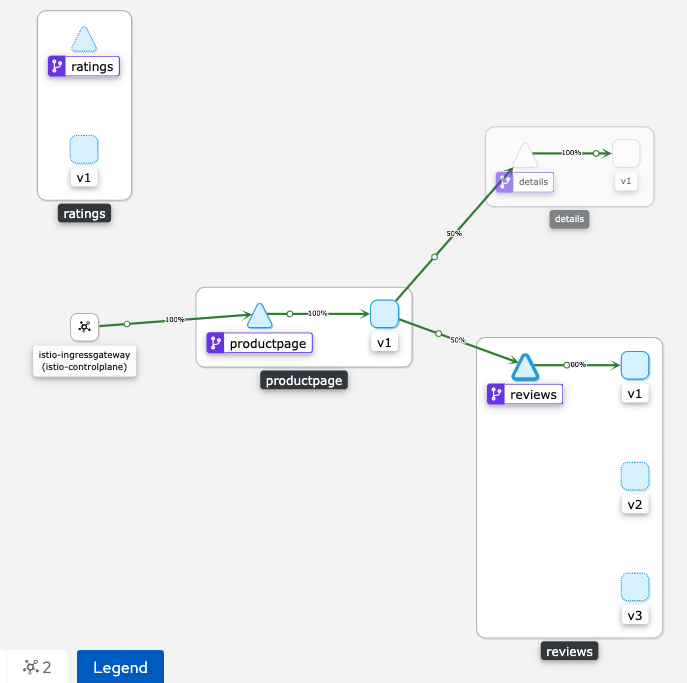

If you want to inspect traffic metrics even further, go to the left menu named `Services` and select the `reviews` service, then click on the `Inbound Metrics` tab:
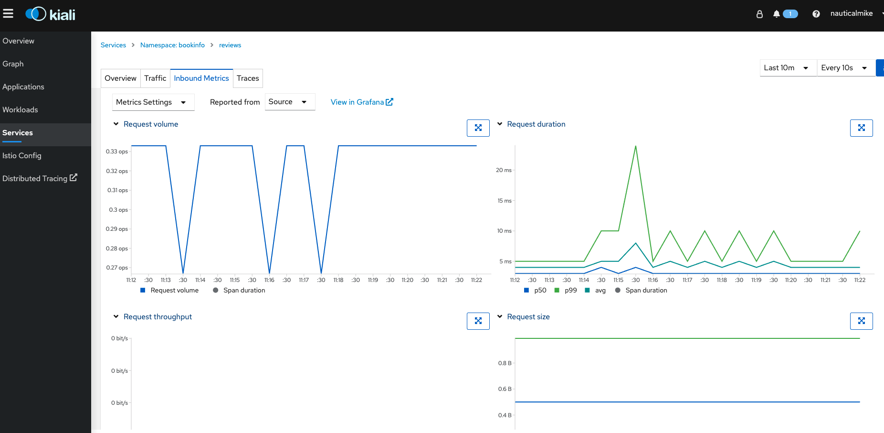

In the same Kiali service view you have the ability to see more in detail metrics by jumping to Grafana, click on the blue link that reads `View in Grafana` and expect something like this:
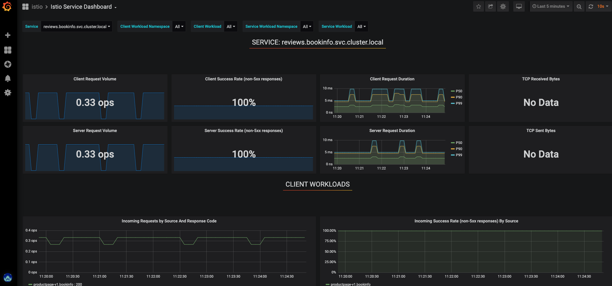

Notice how in Grafana you can see the percentage of requests that are non-5xx responses and the volume of operations per second. 
Additionally you can also detail the 50, 90 and 99 percentiles for request latency, take a close look at the current values.

Lets add some latency to the `reviews` virtual service by adding:
```
http:
  - fault:
      delay:
        percent: 50 
        fixedDelay: 3s
```
Now load the bookinfo app in a browser (http://$ISTIO_GW/productpage) and you should expect something along the lines:
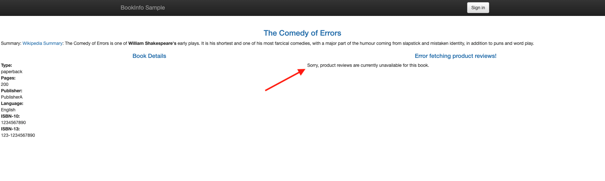

Now lets add a timeout so any requests that take longer than 1s error out:
```
http:
    - route:
        - destination:
          host: reviews
      timeout: 1s
```
Now check out how this reflects on Grafana:
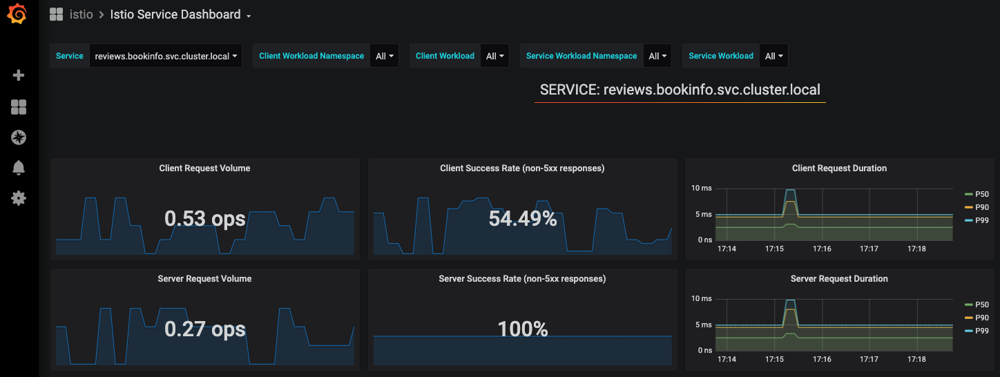
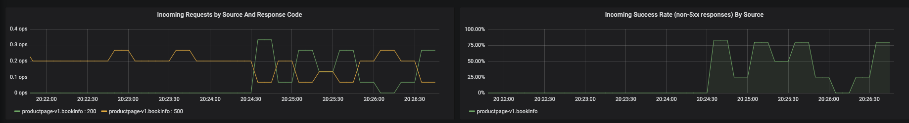

Now we are going to introduce fault injection, find the `reviews` VirtualService and edit it either using the UI or CLI (`oc edit virtualservice reviews`) adding the following:
```
http:
    - route:
        - destination:
            host: reviews
            subset: v1
    - fault:
        abort:
          httpStatus: 500
          percentage:
            value: 99
      route:
        - destination:
            host: reviews
            subset: v1
```

This is going to add an `abort` `fault` causing 500 response codes 99% of the time for the v1 reviews service. Now load the bookinfo app in a browser (http://$ISTIO_GW/productpage) and you should expect something along the lines:


Now go to Kiali and load the graph animation again making sure you select to display `response time` and `traffic animation`:
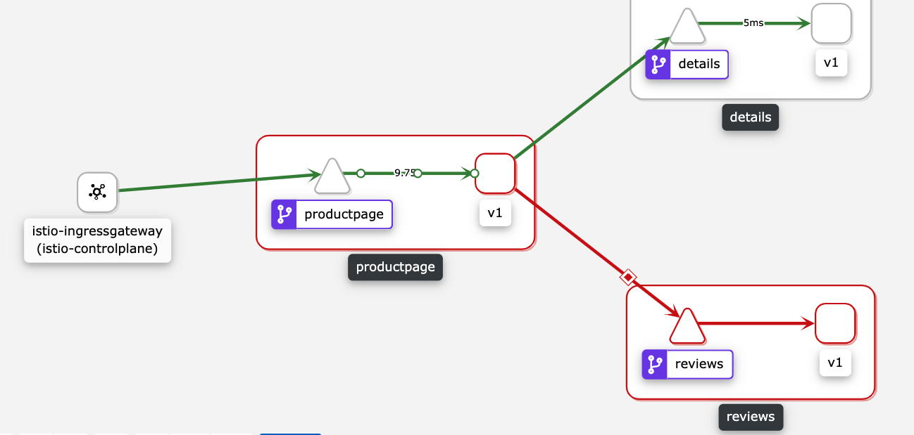

On the details tab you should be able to see some errors, to see more details lets go to the services menu in Kiali and select the `reviews` service, then click on on the `view on Grafana` link, this is going to load the dashboard for the service where we can see the client success rate is less than 1%:
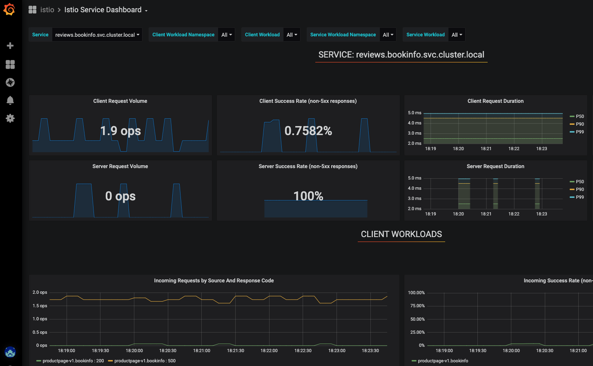

As you can see on the `Incoming Requests by Source and Response Code` graph there are several operations with response code 500 and almost none with 200 response codes:
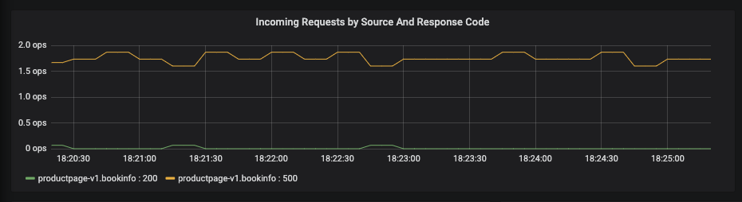

Now lets fix this by adding a retry mechanism to our faulty service in order to improve the management of the faults, go back to the `reviews` virtual service and add:
```
retries:
  attempts: 100
  perTryTimeout: 2s
  retryOn: 5xx
```
Final spec should look like:
```
spec:
  hosts:
    - reviews
  http:
    - route:
        - destination:
            host: reviews
            subset: v1
    - fault:
        abort:
          httpStatus: 500
          percentage:
            value: 99
      retries:
        attempts: 100
        perTryTimeout: 2s
        retryOn: 5xx
      route:
        - destination:
            host: reviews
            subset: v1
```

This specifies 100 attempts in the retry and 2s timeouts in between for 5xx errors. 
Before the retry mechanism you could observe a high number of operations with 500 response codes, now we should see an improvement on the service:
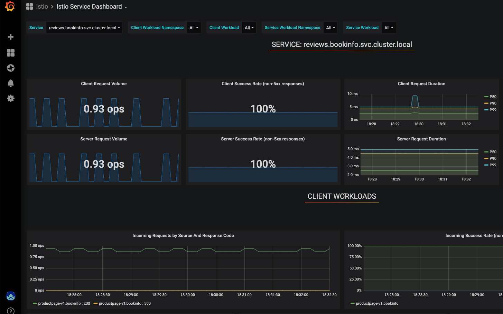

Congratulations you have fixed the service by adding a retry mechanism.