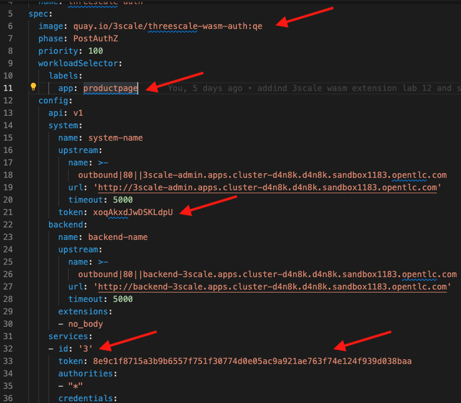
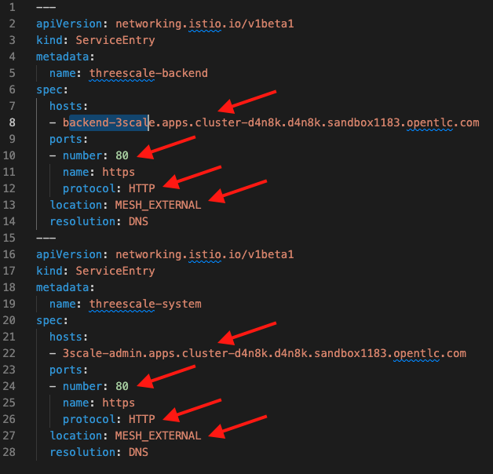

# How to use the 3scale Auth WASM Extension

In this lab you will learn how to use the 3scale Auth WASM extension. For an introduction on WebAssembly and this extension please read [this](https://developers.redhat.com/articles/2021/12/06/custom-webassembly-extensions-openshift-service-mesh#). 

## Prerequisites

1. Have an OpenShift (OCP) v4.9 running cluster
2. 3scale v2.11
3. OSSM v2.1 (No Mixer!)

## Using the WASM Extension

Included in the new v2.1 OSSM release, you can find the `ServiceMeshExtension` CRD which defines the instance of the WASM extension you want to run. There are a lot of WASM extensions out there and you can even create your own, for this lab we are interested in using the 3scale Auth WASM extension.

***NOTE***
***
On the previous 3scale release v2.10 and OSSM v2.0 the 3scale/OSSM integration was done using the 3scale adapter, which uses gRPC to communicate with the OSSM CP Mixer component for policy enforcement. In OSSM v2.1 the Mixer component was completely removed and now in favor of the `ServiceMeshExtension` using WebAssembly.
***

### Configuration

The 3scale WASM extension has 3 main sections for configuration:
* Services 
* System 
* Backend

See attached file named `servicemeshextension.yaml`.

The `Services` configuration section provides the authentication mechanism details to validate with the services you want to use the extension with. The `System` section provides details on how the extension can connect with the 3Scale `system-provider` service and the `backend` section provides the details to connect with the 3scale `backend-listener`.

Take a closer look to the provided `servicemeshextension.yaml` file:



In order to run this 3scale Auth WASM extension we use the CRD `ServiceMeshExtension` that you could also use with any other compatible WASM extensions or even create your own. 

The first red arrow in the picture above indicates the WASM extension image to be used. In this lab we are using the `quay.io/3scale/threescale-wasm-auth:qe` image.

The second arrow specifies the `workloadSelector` for the service you want to match, in our case we are matching the `productpage` service from `bookinfo`.

The third red arrow indicates the `system` `token`, you can find this token in two places, either in the 3scale UI under settings or on the `system-seed` secret in the ns where you have your 3scale CP instance running.

Fourth arrow indicates the service ID, unfortunately continuing the same functionality presented in the adapter (see lab #5) there is still a dependency on the service ID from 3scale to match the service. There is work being done at the moment to remove this dependency.

Finally, the fifth arrow is for the service token, you can generate this service token using the 3scale UI for the service.

For more information on configuration please read [this](https://docs.openshift.com/container-platform/4.9/service_mesh/v2x/ossm-threescale-webassembly-module.html#threescale-configuring-the-threescale-webassembly-module_ossm-threescale-webassembly-module).

## ServiceEntry

By default Istio makes all k8s service resources part of the Istio's service registry. In contrast, OSSM requires adding the ns as part of the `ServiceMeshMemberRoll` for the services in these ns to be discovered. The 3scale Auth WASM extension, which runs on the Envoy sidecar next to the target service (part of the mesh), requires external mesh access to the 3scale `system-provider` and `backend-listener` services (not part of the mesh) to operate, as explained in the previous section. For this reason, in order to expose external network applications to Istio/OSSM we use the `ServiceEntry` resource. `ServiceEntry` enables adding additional entries into Istio’s internal service registry, so that auto-discovered services in the mesh can access/route to these manually specified services.

***NOTE***
***
You can also configure Istio's egress controller policy to be `ALLOW_ANY` in order for in-mesh services to access external services without the need of a `ServiceEntry`.
***

In our case we need to create two `ServiceEntry` resource instances, one for each 3scale `system-provider` and `backend-listener` service, see the attached file named `serviceentry.yaml` below:



In the file descriptor we can see two `ServiceEntry` resources, the host URL, the port, protocol and location `MESH_EXTERNAL`. 

***NOTE***
***
The reason these services are configured using HTTP and port 80 (insecure) instead of 443 and HTTPS, is because of [this bug](https://issues.redhat.com/browse/THREESCALE-7919). Using insecure routes to 3scale required additional configuration, see [this](https://access.redhat.com/solutions/3455941).
***

## Steps to Setup

1. Having `bookinfo` running and part of the SMMR, create a product in 3scale and configure it using the Istio deployment option as described on lab #5.

2. After saving the configuration, get the tokens, Id, protocols and URLs for the `ServiceMeshExtension` resource and create an instance of it as follows:
```
oc apply -f servicemeshextension.yaml -n bookinfo
```

3. Now do the same for the `ServiceEntry` resources and apply them to the same ns:
```
oc apply -f serviceentry.yaml -n bookinfo
```

4. Go to the 3scale web UI and create a new application and application plan using the `user_key` mechanism. Then save the value for the next step.

5. Get your OSSM ingress hostname either by getting the route from the same ns where your SMCP is running, or by running this:
```
ISTIO_GW=$(oc get route istio-ingressgateway -n istio-system -o jsonpath="{.spec.host}{.spec.path}")
```

6. Test your service with `curl` wihtout a key:
```
curl -v $ISTIO_GW/productpage | grep '<title>Simple Bookstore App</title>'
```

You should get a `403 Forbidden` response as now the service is secured using 3scale's `user_key` and enforced using the 3scale Auth WASM extension running on the Envoy sidecar.

7. Test your service with `curl` using the `user_key` provided when you created the application under the plan:
```
curl -v $ISTIO_GW/productpage?user_key=<<MY_USER_KEY_FROM_APP>> | grep '<title>Simple Bookstore App</title>'
```

You should get a `200` HTTP response code along with `'<title>Simple Bookstore App</title>'`.