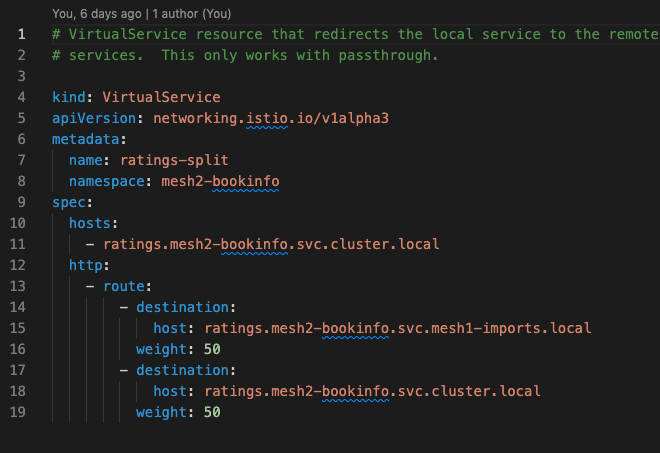
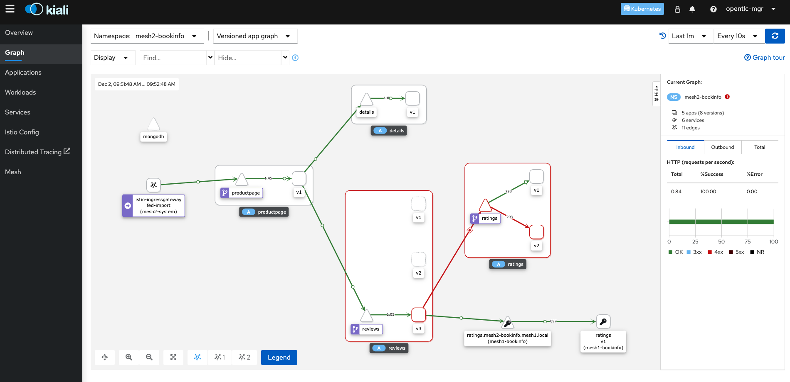

# Service Mesh Federation

Modern cloud based architectures usually bring a lot of questions regarding deployment options to address some concerns. Istio tries to address some of the concerns with the different deployment models supported as explained [here](https://istio.io/latest/docs/ops/deployment/deployment-models/).

OSSM takes a zero-trust approach on the new release supporting Service Mesh Federation, bringing concepts like `ServiceMeshPeer`, `ImportedServiceSet` and `ExportedServiceSet` custom resource definitions, making it really easy to "tunnel" traffic between meshes.

This lab attempts to showcase Federation between two clusters by deploying the `bookinfo` service in both, and importing the `ratings` service into `mesh2` for the `mesh2-bookinfo` service to use following [this](https://cloud.redhat.com/blog/introducing-openshift-service-mesh-2.1-federation-has-arrived) article and this [repo](https://github.com/maistra/istio/tree/maistra-2.1/pkg/servicemesh/federation/example/config-poc) for guidance.

For more information on OSSM Federation please read [this](https://docs.openshift.com/container-platform/4.9/service_mesh/v2x/ossm-federation.html).

## Prerequisites

1. Have one or two OpenShift (OCP) v4.9 running clusters
2. OSSM v2.1 (No Mixer!)

## Preparation

There are tons of articles and tools out there to manage multiple kubeconfig files at a time, for this lab you don't need any and if you intend to use two clusters all that you need to have is two separate kubeconfig files but if you don't have two clusters handy you can also deploy this lab in one cluster by pointing the two shell variables to the same file. See the examples below:

* Two Clusters:
```
export MESH1_KUBECONFIG=~/.kube/context/kubeconfig-cluster-1.yaml
export MESH2_KUBECONFIG=~/.kube/context/kubeconfig-cluster-2.yaml
```

* One Cluster:
```
export MESH1_KUBECONFIG=~/.kube/context/kubeconfig-cluster-1.yaml
export MESH2_KUBECONFIG=~/.kube/context/kubeconfig-cluster-1.yaml
```

The `common.sh` script wraps the `oc` cli tool as `oc1` and `oc2` passing the flags needed to use the corresponding kubeconfig file:
```
oc1() {
  if [ -f "${MESH1_KUBECONFIG}" ]; then
    oc --kubeconfig="${MESH1_KUBECONFIG}" "$@"
  else
    oc "$@"
  fi
}

oc2() {
  if [ -f "${MESH2_KUBECONFIG}" ]; then
    oc --kubeconfig="${MESH2_KUBECONFIG}" "$@"
  else
    oc "$@"
  fi
}
```

## Installing the lab

In order to install all that is needed is to have is the kubeconfig files setup to access your cluster(s) and run the attached `install.sh` script:
```
./install.sh
```

## Explanation

The install script not only creates the ns/projects needed but also creates the SMCP instances on each cluster, adds ns/projects to the `ServiceMeshMemberRoll` on each mesh, then it gets the addresses, discovery ports and service ports of each mesh in each cluster including the root CA certs needed to setup the certificate chain for each `ServiceMeshPeer` instance. 

Finally the script deploys `bookinfo` on each mesh, setups `DestinationRule`(s) for the services and more importantly sets the imported `ratings` service as a `VirtualService`. More importantly this `VirtualService` is configured for the cluster2/mesh2 `bookinfo` to be split 50%/50% traffic load between the local cluster2/mesh2 `ratings` service and the imported `ratings` service from cluster1/mesh1:



***NOTE***
***
Pay special attention to the certificate management required  to setup federation between to SMCP. We extract the CA root cert from each SMCP and set it up as a `configmap` on the opposite mesh to be used by the the corresponding `ServiceMeshPeer` as a certificate chain to be able to access the mesh:

```
security:
    trustDomain: mesh2.local
    clientID: mesh2.local/ns/mesh2-system/sa/mesh1-egress-service-account
    # same as default, if certificateChain is omitted
    certificateChain:
      kind: ConfigMap
      name: mesh2-ca-root-cert
```
and
```
security:
    trustDomain: mesh1.local
    clientID: mesh1.local/ns/mesh1-system/sa/mesh2-egress-service-account
    # same as default, if certificateChain is omitted
    certificateChain:
      kind: ConfigMap
      name: mesh1-ca-root-cert
```
***

## Testing
Run the following command in the mesh1 cluster to check the connection status:
```
  oc -n mesh1-system get servicemeshpeer mesh2 -o json | jq .status
```

Run the following command to check the connection status in mesh2:
```
  oc -n mesh2-system get servicemeshpeer mesh1 -o json | jq .status
```

Check if services from mesh1 are imported into mesh2:
```
  oc -n mesh2-system get importedservicesets mesh1 -o json | jq .status
```

To see federation in action, use the bookinfo app in mesh2. For example:

  1. Run this command in the mesh1 cluster: 
    ```
    oc logs -n mesh1-bookinfo deploy/ratings-v2 -f
    ```

  2. Run this command in the mesh2 cluster: 
    ```
    oc logs -n mesh2-bookinfo deploy/ratings-v2 -f
    ```

  3. Open in a browser and refresh:
    ```
    http://$(oc2 -n mesh2-system get route istio-ingressgateway -o json | jq -r .spec.host)/productpage
    ```
    or get the hostname URL and do step #4:
    ```
    ISTIO_GW=$(oc2 get route istio-ingressgateway -n mesh2-system -o jsonpath="{.spec.host}{.spec.path}")
    ```

  4. Refresh the page several times and observe requests hitting either the mesh1 or the mesh2 cluster:
  ```
  while true; do curl $ISTIO_GW/productpage; sleep 3; done
  ```

  5. Open Kiali from each mesh on separate browser windows, and on the cluster1/mesh1 select the bookinfo ratings service and go to graph, then select the drop down to view the traffic animation. Do the same for cluster2/mesh2 and select the whole bookinfo project.

## Analyzing results

The expected result is better seen in each Kiali traffic animation where you should see traffic from an external entity going directly to the ratings service which is the service exported by `mesh1` imported into `mesh2` and you should see no traffic at all on `mesh1-bookinfo` `productpage` service. 

Subsequently you should see traffic generated from the `curl` loop to the ingress controller on `mesh2-system` then into the `bookinfo`s `productpage` service, then to the `reviews` service and finally split into the local `ratings` and the imported from `mesh1` as shown below:

